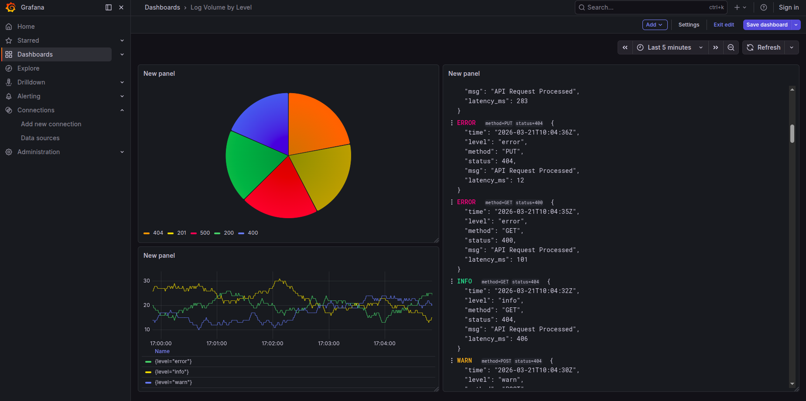

# 📊 Grafana + Loki + Promtail: Centralized JSON Logging Demo

This project provides a **self-contained, automated environment** to demonstrate centralized logging. It uses a "Loki Stack" to ingest, parse, and visualize JSON logs generated by a mock application.

## 🚀 Quick Start

1. **Prerequisites**: Ensure you have `docker`, `docker-compose`, and `python3` installed.
2. **Run the Setup**:
   ```bash
   chmod +x setup_loki.sh
   ./setup_loki.sh

3.  **Access Grafana**: Open [http://localhost:3000](https://www.google.com/search?q=http://localhost:3000).

-----

## 🏗️ Architecture details

| Component | Role | Port |
| :--- | :--- | :--- |
| **Loki** | The log aggregation engine (the "database"). | `3100` |
| **Promtail** | The agent that ships logs from files to Loki. | `9080` |
| **Grafana** | The visualization UI for querying logs. | `3000` |
| **Python Script** | Simulates a real app producing JSON logs. | N/A |

### 🛠️ The JSON Pipeline

The system is configured to handle **structured logging**. When the Python script writes a log entry:

```json
{"level": "error", "method": "POST", "status": 500, "msg": "API Request Processed"}
```

Promtail uses a **pipeline stage** to extract `level`, `method`, and `status` as **Loki Labels**. This allows for high-performance filtering (e.g., finding all `status=500` logs) without full-text searching.

-----

## 📈 Usage Instructions

### 1\. Viewing Logs

1.  Navigate to the **Explore** tab (Compass icon) in the left sidebar.
2.  Select **Loki** from the dropdown menu at the top.
3.  In the query builder, select the Label filters:
      - `job` = `app_logs`
4.  Click **Run Query**.

### 2\. Live Tail

Click the **Live** button in the top right corner of the Explore view to see logs streaming in real-time as the Python script generates them.

### 3\. Advanced Query Examples (LogQL)

Paste these into the query bar:

  * **Filter by Error level:**
    `{job="app_logs", level="error"}`
  * **Count logs by status code over time:**
    `sum by (status) (count_over_time({job="app_logs"}[1m]))`

-----
## Creating Dashboad

Here is a step-by-step tutorial designed to walk through creating these three dashboards. This structured approach works well both as a personal reference and as a practical lab exercise for teaching observability concepts in full-stack software development or data engineering.

Before starting, ensure your `docker-compose up -d` stack is running and the `gen_logs.py` script is actively generating data in the background.

---

### Step 1: Initial Dashboard Setup

First, we need to create the blank canvas where all three visualizations will live.

1. Open Grafana at `http://localhost:3000`.
2. On the left-hand menu, click the **"+" icon** (Create) and select **Dashboard**.
3. Click the **Add visualization** button.
4. Select **Loki** as your data source.

---

### Step 2: Creating Dashboard 1 – Service Health (Time-Series)

This panel will track the volume of logs categorized by their severity level over time.

1. **Set the Query:** In the query editor at the bottom, switch to the **Builder** or **Code** tab. If using Code, paste the following LogQL:
   `sum by (level) (count_over_time({job="app_logs"}[1m]))`
2. **Run Query:** Click the **Run queries** button (or press `Shift + Enter`). You should see lines appear on the graph.
3. **Configure the Visualization:**
   * On the right-side menu, ensure the visualization type at the top is set to **Time series**.
   * Scroll down to the **Standard options** section and set the **Unit** to `short` (or leave it default).
   * Scroll to the **Legend** section. Set the **Mode** to `Table` and **Placement** to `Bottom`.
   * *Optional:* To make it cleaner, go to the **Options** next to your query and type `{{level}}` in the **Legend** field to remove redundant label text.
4. **Save Panel:** Give the panel a title like "Log Volume by Level" in the right menu, then click **Apply** in the top right corner.

---

### Step 3: Creating Dashboard 2 – Traffic Distribution (Pie Chart)

This panel will visualize the distribution of HTTP status codes to quickly identify success vs. failure ratios.

1. Back on your main dashboard screen, click the **Add panel** icon (the graph with a plus sign at the top).
2. Select **Loki** as the data source.
3. **Set the Query:** In the code editor, paste:
   `sum by (status) (count_over_time({job="app_logs"}[5m]))`
4. **Change Visualization Type:** Look at the top-right menu. Click the dropdown that says *Time series* and change it to **Pie chart**.
5. **Configure the Pie Chart:**
   * In the right-side menu, under **Pie chart**, change **Show** to `Calculate` and **Calculation** to `Total`.
   * *Coloring (Crucial step for status codes):* Scroll down to **Value mappings**. Click **Add value mapping**.
     * Add a condition: If value is `200`, change color to **Green**.
     * Add a condition: If value is `400` or `404`, change color to **Yellow/Orange**.
     * Add a condition: If value is `500`, change color to **Red**.
6. **Save Panel:** Title this panel "HTTP Status Distribution" and click **Apply**.

---

### Step 4: Creating Dashboard 3 – Live Audit Trail (Logs)

This panel will act as a live, filtered tail of only the problematic requests (4xx and 5xx errors).

1. Click **Add panel** again and select **Loki**.
2. **Set the Query:** Paste this specific LogQL query. *Note the use of the regex operator `=~` to catch any status code starting with 4 or 5.*
   `{job="app_logs", status=~"4..|5.."}`
3. **Change Visualization Type:** In the top-right dropdown, change the visualization from *Time series* to **Logs**.
4. **Configure the Logs Panel:**
   * In the right-side menu, under **Logs**, toggle **Wrap lines** to `True` so longer JSON payloads don't run off the screen.
   * Toggle **Prettify JSON** to `True`. This formats the raw JSON payload into a readable, indented structure.
   * Toggle **Enable unique labels** to `True`. This hides repetitive labels (like `job="app_logs"`) and only shows what is unique to that specific log line.
5. **Set Time Range:** For live debugging, change the time range in the very top right corner of Grafana from *Last 6 hours* to **Last 5 minutes**.
6. **Save Panel:** Title it "Error Audit Trail" and click **Apply**.

---

### Step 5: Finalizing

1. Click the **Save dashboard** icon (the floppy disk) at the very top of the screen.
2. Give your dashboard a name (e.g., "Application Observability Overview") and click **Save**.
3. You can now click and drag the bottom-right corners of your panels to resize them and arrange them cleanly on your screen.

-----

## 🧹 Cleanup

To stop the services and remove the containers:

```bash
docker-compose down
```

To remove generated logs and configurations:

```bash
rm -rf logs/ grafana_provisioning/ loki-config.yaml promtail-config.yaml docker-compose.yaml gen_logs.py
```

---

### User Instructions (Practical Guide)

**Step 1: Verify your Environment**
Since you are likely running this on a server or a local development machine, ensure that ports **3000** and **3100** are not occupied. If you are using a remote server, ensure your firewall allows traffic on port 3000.

**Step 2: Understanding the Log Generation**
The `gen_logs.py` script included in the bash setup is a "blocking" process. It will keep running in your terminal to show you the logs being created.
* To stop the generator: Press `Ctrl + C`.
* To run it in the background: Use `python3 gen_logs.py &`.

**Step 3: Navigating the Dashboard**
I have enabled **Anonymous Admin** access in the script. You will not be prompted for a username or password. You have full rights to create dashboards and save them.

**Step 4: Troubleshooting**
* **No logs appearing?** Check if the files exist: `ls -l logs/app.log`.
* **Promtail errors?** Check the Promtail container logs: `docker logs grafana-loki-demo-promtail-1`.
* **Permission issues?** If running on Linux, the `chmod 777 logs` command in the script is vital because the Docker user (usually UID 1000) needs to read files created by your local user.


